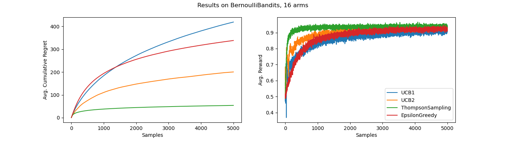

# Jax Bandits

A fast Jax based library for multi-armed bandit problems.

Includes the following algorithms
- UCB1, UCB2
- Thompson Sampling
- Epsilon Greedy

Via Jax and `vmap`, you can easily sample with an algorithm e.g. Epsilon Greedy 50 million times per second if you wanted to on a single GPU.

## Installation

The package only depends on [jax](https://github.com/google/jax) and [flax](https://github.com/google/flax). Follow instructions on those repositories for how to install

To install this package, run

```
pip install --upgrade git+https://github.com/StoneT2000/jax-bandits.git
```

## Usage

This library provides a simple jax based environment interface for multi-armed bandits as well as algorithms.

The following shows how to initialize an environment and an algorithm.

```python
import jax
import numpy as np
from jaxbandits import BernoulliBandits, algos

# set backend to CPU as usually it's faster due to the dispatch overhead on the GPU.
# GPU is useful if you plan to vmap the functions
jax.config.update('jax_platform_name', 'cpu')

key = jax.random.PRNGKey(0)
key, env_key = jax.random.split(key)

# First intialize a bandit environment e.g. Bernoulli Bandits which comes with the environment state and functions
env = BernoulliBandits.create(env_key, arms=16)
# Then we initialize an algorithm e.g. Thompson Sampling which comes with the algo state and functions
algo = algos.ThompsonSampling.create(env.arms)
```

To then start experimenting and solving, run

```python
N = 4096
regrets = []
for i in range(N):
    key, step_key = jax.random.split(key)
    # perform one update step in the algorithm. Provide RNG, algorithm state, and the environment. 
    # Note that since all things jax are immutable, an updated env and algo object is returned as well
    algo, env, action, reward = algo.update_step(step_key, env)
    
    # store the regret values
    regret = env.regret(action)
    regrets += [regret]
cumulative_regret = np.cumsum(np.array(regrets))
```

For a packaged, jitted version of the above loop, you can use the `experiment` function in the package

```python
from jaxbandits import experiment
res = experiment(key, env, algo, N)
cumulative_regret = np.cumsum(np.array(res["regret"]))
rewards = np.array(res["reward"])
actions = np.array(res["action"])
```

The above code can be found in [examples/experiment.py](https://github.com/StoneT2000/jax-bandits/blob/main/examples/experiment.py). Simply change the environment class and algorithm class to test them out.

Due to the high volume of small operations, usually using the CPU backend will be faster. The GPU backend will be better if you plan to `vmap/pmap` the code, which is all possible as all of the algorithms and environments are registered as pytree nodes (via the `@flax.struct.dataclass` decorator). 

To run a batch of experiments, simply `vmap` the `experiment` function. Example parallelization code is provided in [examples/parallel.py](https://github.com/StoneT2000/jax-bandits/blob/main/examples/parallel.py)

## Algos

The following algos are accessible as so

```python
from jaxbandits import algos
algos.ThompsonSampling
algos.UCB1
algos.UCB2
algos.EpsilonGreedy
```

## Example Results

Run 
```
python scripts/bench.py
```

to generate the following figure, showing a comparison of algorithms.

